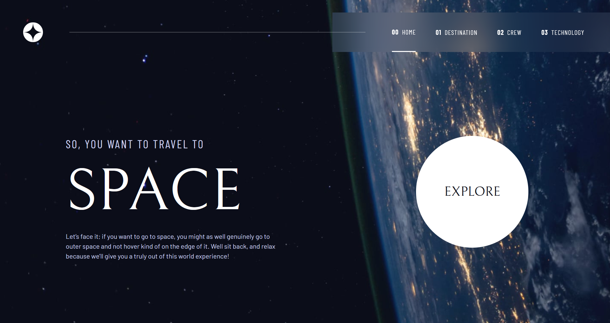

# Frontend Mentor - Space tourism website solution

This is a solution to the [Space tourism website challenge on Frontend Mentor](https://www.frontendmentor.io/challenges/space-tourism-multipage-website-gRWj1URZ3). Frontend Mentor challenges help you improve your coding skills by building realistic projects. 

## Overview

### The challenge

Users should be able to:

- View the optimal layout for each of the website's pages depending on their device's screen size
- See hover states for all interactive elements on the page
- View each page and be able to toggle between the tabs to see new information

### Screenshot



### Links

- Live Site URL: [live site URL here](https://space-tourism-website-main-eight-chi.vercel.app/)

## My process
### Built with
- Semantic HTML5 markup
- CSS custom properties
- Flexbox
- CSS Grid
- Mobile-first workflow
- React
- React Router DOM
- Tailwind CSS
- Vite
- Accessibility-focused interactions (keyboard focus, outside-click handling)

### What I learned

This project strengthened my understanding of layout behavior, React architecture, and browser mechanics rather than just styling.

One major realization was the difference between h-full and flex-1 in flex layouts.

h-full means match the parent height, while flex-1 means take the remaining space. That distinction fixed several overflow bugs in my layout.

I also learned how stacking context works and how properties like transform and z-index can unintentionally affect positioning.

Another important concept was preloading images to improve perceived performance:

```js
useEffect(() => {
  data[0].technology.forEach((t) => {
    new Image().src = t.images.portrait;
    new Image().src = t.images.landscape;
  });
}, []);
```

This taught me how browser caching directly impacts UI responsiveness.

I also learned to use useRef instead of getElementById for handling outside-click detection in React components.

### Continued development
Improve accessibility (ARIA roles, keyboard navigation, focus management)
Add smoother transitions between carousel slides
Deepen understanding of performance optimization (image loading, rendering behavior)
Refine component architecture and state management patterns
Practice debugging layout issues faster without trial-and-error
Useful resources
Kevin Powell — CSS Layout & Stacking Context tutorials
React Router documentation — understanding Outlet and layout structure
MDN Web Docs — Flexbox sizing behavior
Tailwind documentation — responsive utilities and @apply usage
YouTube — Image masking techniques for modern UI effects

These resources helped me move from guessing solutions to understanding why they work.

### AI Collaboration

I used AI tools as a debugging and learning assistant rather than a shortcut.

#### Tools used:

ChatGPT
GitHub Copilot

#### How I used them:

Debugging deployment dependency issues
Understanding React event handling and state timing
Learning better approaches to image handling and performance
Brainstorming implementation strategies

#### What worked well:

AI helped explain underlying concepts like event bubbling, caching, and layout behavior, which improved my problem-solving ability.

#### What didn't work well:

Sometimes AI suggested workarounds instead of the correct underlying technique (for example, using overlays instead of image masking). I learned to verify solutions independently.

## Author
Frontend Mentor — https://www.frontendmentor.io/profile/nazeeha-kb
LinkedIn — https://www.linkedin.com/in/nazeeha-kb

## Acknowledgments

Thanks to the developer community and educators who create high-quality learning content. Tutorials and documentation played a key role in helping me understand complex concepts like stacking context, layout behavior, and performance optimization.
